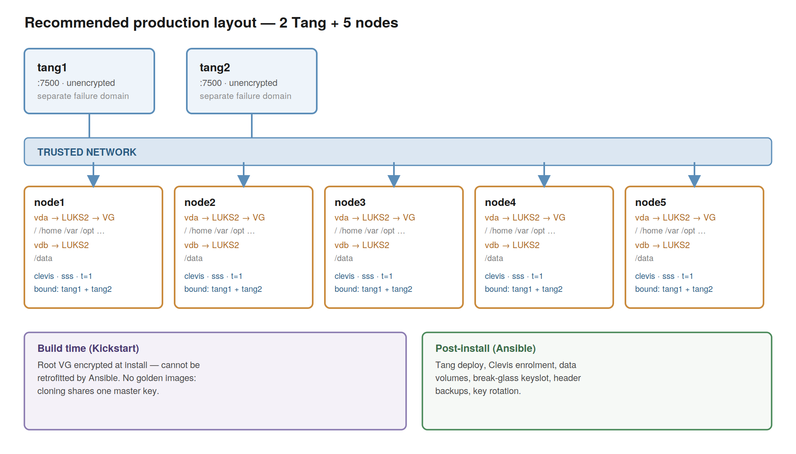

# RHEL LUKS + NBDE Automation

Ansible automation for unattended-boot disk encryption on RHEL.
## What this does

Encrypts RHEL hosts with LUKS2 and lets them boot without a passphrase prompt, using Network Bound Disk Encryption (NBDE). Two components: Tang (key server) and Clevis (client, runs in the initramfs).

**Root disk encryption must happen at install time (Kickstart).** Ansible cannot encrypt a mounted root filesystem — everything here runs after that.

## Architecture



- Each node's OS volume group is a single LUKS2 container, so one unlock covers `/`, `/home`, `/var`, etc.
- Data disks get their own LUKS2 container.
- Every node binds to **both** Tang servers via the `sss` pin, threshold 1, either one alone is enough to boot.
- No golden images: `clevis luks bind` doesn't change the master key, so cloned hosts would share one key.

## Layout

```
inventory.yml
group_vars/
  nbde_clients.yml       # tang_urls, vaulted passphrases
host_vars/
  node1.yml              # luks_bindings, data_volumes (per host)
  node2.yml
playbooks/
  nbde_server_playbook.yml   # deploys Tang
  nbde_client_playbook.yml   # binds LUKS devices to Tang
  data_volume_playbook.yml   # creates + encrypts a data disk
  site.yml                   # orchestrates all three, in order
```

## Requirements

```bash
sudo dnf install linux-system-roles      # provides fedora.linux_system_roles
ansible-galaxy install -r requirements.yml
```

`ansible-core >= 2.16.1`. RHEL/Fedora family

## Usage

Deploy Tang:
```bash
ansible-playbook -i inventory.yml playbooks/nbde_server_playbook.yml
```

Add an encrypted data volume, then bind it:
```bash
ansible-playbook -i inventory.yml playbooks/data_volume_playbook.yml
ansible-playbook -i inventory.yml playbooks/nbde_client_playbook.yml
```

Everything, one host:
```bash
ansible-playbook -i inventory.yml playbooks/site.yml
```

Always `--check` first against anything with existing data. The `storage` role refuses to overwrite existing formatting unless `storage_safe_mode: false` — don't disable that globally.

## Scope

Covers data at rest: stolen/lost disks, RMA returns, decommissioned hardware. Does **not** cover a compromised running host, or a snapshot of a *running* guest (contains the LUKS master key in memory). Network-attached storage is out of scope — handled by the storage platform, not LUKS.
